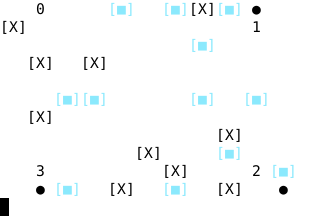

# Multi-Agent Reinforcement Learning @ NIPS 2018

This repository is an open-source implementation of a Multi-Agent Reinforcement Learning Agent that will participate in the NIPS 2018 [Pommerman challenge](https://www.pommerman.com/). For a full list of availble competitions this year at the NIPS conference, see the [competition track](https://nips.cc/Conferences/2018/CompetitionTrack).

This repository also provides a re-implementation for the environment. This is how the C++ backend currently looks like: 



## Prerequisites

To compile and run this project from source you will require

- Linux Distribution (Tested on Ubuntu 18.04)
- GCC 7.3.0
- MAKE 4.1
- CUDA 9 (not yet necessary, will be updated)

## Setup

#### Download

This project uses the [playground environment](https://github.com/MultiAgentLearning/playground) as a submodule. To fully clone the repository use
```
# git version 2.13+
$ git clone --recurse-submodules https://github.com/m2q/nips2018-agent.git

# git version 2.12 or less
$ git clone --recursive https://github.com/m2q/nips2018-agent.git
```
#### Compilation

* Use `./run.sh` to **compile** the main application and run it.
* Use `./test.sh` to test the project. We use the [Catch2 Unit Testing Framework](https://github.com/catchorg/Catch2).

Instead of using the shell scripts you can obviously use make commands and call/debug the binaries yourself. Here is a list:

| Command | What it does |
| ------- | ------------ |
| `make` or `make all`  | Compiles and links both test and main source files and creates a static library |
| `make main` | Compiles the main source to ./bin/exec and creates a library in ./lib/pomlib.a |
| `make test`  | Compiles the test source to ./bin/test  | 
| `make clean`  | Removes ./bin and ./build  |
| `make mclean`  | Removes ./bin/exec and ./build/src only |

Tip: The makefile makes use of the MAKEFLAGS environment variable. Let's say you want
to have `-j n` as the default job count, where `n` is the number of cores available on
your system. Then just export an env variable like this

```
$ export MAKEFLAGS="-j $(grep -c ^processor /proc/cpuinfo)"
```

(or alternatively add it to your `${HOME}.profile`)

## Use PommermanC++ as a Static Library

Building the project with `make` compiles a static library in `./lib/pomlib.a`. This contains the `bboard` and `agents` namespace. Include the headers in `./src/...` and you're good to go.

## Project Structure

All of the main source code is in `src/*` and all testing code is in `unit_test/*`. The source is divided into modules

```
src
 |
 |_ _ _ bboard
 |        |_ _ _ bboard.hpp
 |        |_ _ _ ..
 |
 |_ _ _ agents
 |        |_ _ _ agents.hpp
 |        |_ _ _ ..
 |
 |_ _ _ main.cpp
```

All environment specific functions (forward, board init, board masking etc) reside in `bboard`. Agents can be declared
in the `agents` header and implemented in the same module.

All test cases will be in the module `unit_test`. The bboard should be tested thoroughly so it exactly matches the specified behaviour of Pommerman. The compiled `test` binary can be found in `/bin`

## Testing

Want to test out how many steps can be simulated on your machine in 100ms?

```
# example of 4 threads on an Intel i5 (Skylake/4 cores)
$ ./performance.sh -t 4 

Activated Multi-Threading for performance tests. 
	Thread count:            4
	Max supported threads:   4

Test Results:
Iteration count (100ms):         586.332
Tested with:                     agents::HarmlessAgent

===============================================================================
All tests passed (1 assertion in 1 test case)

```
You can also directly run the test-binaries. For a list of command line arguments
see the Catch2 CLI docs (or run `./test --help`). Here are some typical examples
I use a lot:

| Command | What it does |
| ------- | ------------ |
| `./test`  | Runs all tests, including a performance report |
| `./test "[step function]"` | Tests only the step function  |
| `./test ~"[performance]"` | Runs all test except the performance cases| 


## Defining Agents

To create a new agent you can use the base struct defined in `bboard.hpp`. To add your own agent, declare it in
`agents/agents.hpp`and provide a source file in the same module. For example:

agents.hpp (excerpt)
```C++
/**
 * @brief Uses a hand-crafted FSM with stochastic noise
 */
struct MyNewAgent : bboard::Agent
{
    bboard::Move act(bboard::State* state) override;
};
```

fsm_agent.cpp
```C++
#include "bboard.hpp"
#include "agents.hpp"

namespace agents
{

bboard::Move MyNewAgent::act(bboard::State* state)
{
    // TODO: Implement your logic
    return bboard::Move::IDLE;
}

}
```
## Citing This Repo

```
@misc{Alic2018nips,
  author = {Alic, Adrian},
  title = {Distributed Async MARL Competition Entry},
  year = {2018},
  publisher = {GitHub},
  journal = {GitHub repository},
  howpublished = {\url{https://github.com/m2q/nips2018-agent}}
}

```
